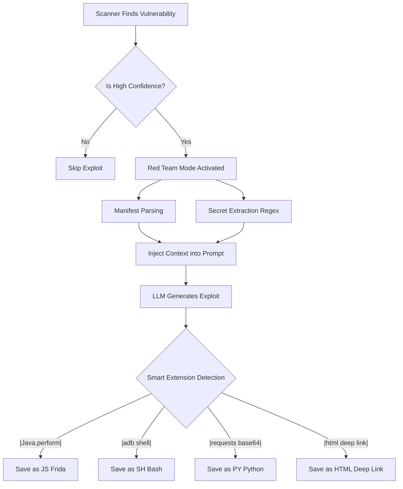

# Auto-Exploit Generation

**Auto-Exploit Generation** transforms Droid LLM Hunter from a passive scanner into an active **Red Team Assistant**. It doesn't just tell you *what* is wrong; it gives you the code to *prove* it.

---

## 🛑 The Problem: "Is it really exploitable?"

Standard SAST tools (and even AI scanners) flag hundreds of "Potential Vulnerabilities".
*   "Exported Activity found." (So what? Is it dangerous?)
*   "Hardcoded String found." (Is it a key or just a label?)

Security Analysts waste hours manually writing scripts just to verify if these findings are real threats or False Positives.

---

## 🎯 The Solution: Active Proof-of-Concept

Droid LLM Hunter generates **ready-to-execute** exploit scripts for every confirmed High/Critical vulnerability.

**When the Engine finds a vulnerability:**
1.  **Re-Analyzes** the code specifically for exploitation vectors.
2.  **Extracts** necessary metadata (Package names, Components, Keys).
3.  **Generates** a focused script (Bash, Python, HTML, or Frida).

---

## 🧠 Core Features

### 1. Manifest-Aware Payload Injection 🗺️
*   **Problem**: AI models hallucinate Intent actions and Deep Link URLs (e.g., guessing `example://test` when the app uses `myapp://webview`).
*   **Solution**: The engine parses `AndroidManifest.xml`, extracts the **exact** Intent Filters (Schemes, Hosts, Paths), and injects this context into the prompt.
*   **Result**: Generated HTML/Bash exploits use the **100% correct URL**, guaranteeing the Deep Link triggers the target component.

### 2. Hardcoded Secrets "Auto-Fill" 🔑
*   **Problem**: An exploit script with `API_KEY = "PLACEHOLDER"` is useless. You have to manually copy-paste the key from the source code.
*   **Solution**: A specialized Regex engine (`CodeFilter`) hunts for:
    *   Google API Keys (`AIza...`)
    *   Bearer Tokens / AWS Keys
    *   Map/JSON assignments (`.put("enc_data", "XXX")`)
*   **Result**: The generated Python/Bash script comes **pre-filled** with the actual stolen secrets. It works out-of-the-box.

### 3. Smart Filtering (Logic Guard) 🛡️
*   **Problem**: If the AI hallucinates a "Hardcoded Secret" finding but there is no actual secret, generating an exploit is a waste of tokens and disk space.
*   **Solution**: The Engine checks: **If Vulnerability == "Hardcoded Secrets" AND Regex Result == Empty -> STOP.**
*   **Result**: Zero "trash" exploits. Only valid, useful scripts are generated.

---

## 🛠️ Technical Workflow



---

## 📂 Output Formats

| File Type | Purpose | Triggered By |
| :--- | :--- | :--- |
| **Bash (`.sh`)** | Activity launching, Intent fuzzing | SQL Injection, Access Control Bypass |
| **Python (`.py`)** | Crypto breaking, API requests, Logic | Hardcoded Secrets, Insecure Encryption |
| **HTML (`.html`)** | Deep Link triggering, XSS | WebView Vulnerabilities, Deep Links |
| **Frida (`.js`)** | Runtime hooking, Bypass | SSL Pinning, Biometric Bypass, Root Detection |

---

## 🚀 Usage

Simply add the `--generate-exploit` flag to your scan command:

```bash
python dlh.py scan target.apk --generate-exploit
```

**Note on Cost ⚠️**:
This feature triggers a secondary LLM call for each vulnerable file. It provides deeper analysis but increases API token consumption. Use on targeted audits.

---

## ⚠️ Important Disclaimer: AI Accuracy & Auto-Verification

**Is the generated exploit always 100% correct? NO.**

Like the Scanner module, the Exploit Generator is powered by AI (LLM), which is **probabilistic**.
1.  **Hallucinations**: The AI might invent an Intent Action that *sounds* real but doesn't exist in the app.
2.  **False Positives**: The generated script might report "SUCCESS" based on a misunderstood system log (e.g., interpreting `accessing hidden method` as a file read).

**Always Verify Manually:**
*   Treat the generated script as a **Prototype** or **Lead**.
*   Read the code. Does the Logic make sense?
*   Check the `adb` commands. Are the component names correct?
*   **Trust, but Verify.** The "Auto-Verification" feature in Python scripts is a helper, not a guarantee.


