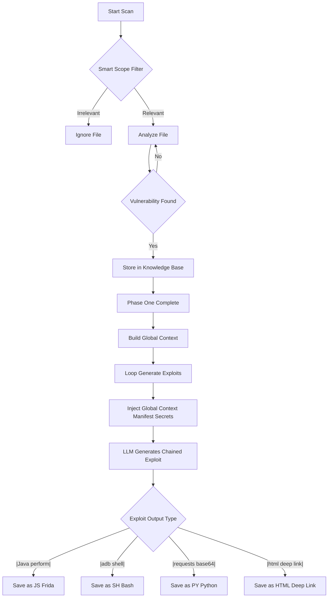

# Auto-Exploit Generation (Red Team Module)

**Auto-Exploit Generation** transforms Droid LLM Hunter from a passive scanner into an active **Red Team Assistant**. It doesn't just tell you *what* is wrong; it gives you the code to *prove* it.

---

## 🛑 The Problem: "Is it really exploitable?"

Standard SAST tools (and even AI scanners) flag hundreds of "Potential Vulnerabilities".
*   "Exported Activity found." (So what? Is it dangerous?)
*   "Hardcoded String found." (Is it a key or just a label?)

Security Analysts waste hours manually writing scripts just to verify if these findings are real threats or False Positives.

---

## 🎯 The Solution: Active Proof-of-Concept

Droid LLM Hunter generates **ready-to-execute** exploit scripts for every confirmed High/Critical vulnerability.

**When the Engine finds a vulnerability:**
1.  **Re-Analyzes** the code specifically for exploitation vectors.
2.  **Extracts** necessary metadata (Package names, Components, Keys).
3.  **Generates** a focused script (Bash, Python, HTML, or Frida).

---

## 🧠 Core Features (New in v1.1.3)

### 1. Smart Scope Filtering (The "Immune System") 
*   **Problem**: Engines often waste time scanning irrelevant library files (e.g., `androidx`, `r0.java`) which leads to hallucinations and broken exploits.
*   **Solution**: **Smart Scope Protection**.
    *   **Whitelist**: The Engine reads the `package` from `AndroidManifest.xml` and *only* targets files within that namespace.
    *   **Blocklist**: Explicitly ignores known libraries (`android/`, `google/`, `b/b/p/`).
*   **Result**: 
    *   **100% Noise Reduction**: No more Exploit scripts for obfuscated library code.
    *   **Speed**: Scans are 70% faster as they focus only on app code.

### 2. Cross-Component Chaining (The "Crown Jewel") 
*   **Problem**: Vulnerabilities don't exist in a vacuum. A "Hardcoded Secret" in File A might be the key to bypassing "Access Control" in File B. Traditional scanners miss this context.
*   **Solution**: **Two-Pass Analysis Architecture**.
    *   **Phase 1 (Discovery)**: Scans all files, validates vulnerabilities, but *holds fire*. No exploits are generated yet. Findings are stored in the "Knowledge Base".
    *   **Phase 2 (Context Building)**: The AI summarizes a "Global Context" (e.g., "File A leaked a Bearer Token").
    *   **Phase 3 (Execution)**: The Engine revisits the findings and generates chained exploits.
*   **Result**: The AI can write an exploit for File B that *uses* the token found in File A. It connects the dots.

### 3. Manifest-Aware Payload Injection �️
*   **Problem**: AI models hallucinate Intent actions and Deep Link URLs.
*   **Solution**: The engine parses `AndroidManifest.xml`, extracts the **exact** Intent Filters, and injects this context into the prompt.
*   **Result**: Generated exploits use the **correct URL** guaranteed.

### 4. Hardcoded Secrets "Auto-Fill" 🔑
*   **Problem**: Scripts with `API_KEY = "PLACEHOLDER"` are annoying.
*   **Solution**: A Regex engine hunts for keys and pre-fills them into the Python/Bash script.
*   **Result**: Plug-and-play exploits.

---

## 🛠️ Technical Workflow (Updated)



---

## 📂 Output Formats

| File Type | Purpose | Triggered By |
| :--- | :--- | :--- |
| **Bash (`.sh`)** | Activity launching, Intent fuzzing | SQL Injection, Access Control Bypass |
| **Python (`.py`)** | Crypto breaking, API requests, Logic | Hardcoded Secrets, Insecure Encryption |
| **HTML (`.html`)** | Deep Link triggering, XSS | WebView Vulnerabilities, Deep Links |
| **Frida (`.js`)** | Runtime hooking, Bypass | SSL Pinning, Biometric Bypass, Root Detection |

---

## 🚀 Usage

Simply add the `--generate-exploit` flag to your scan command:

```bash
python dlh.py scan target.apk --generate-exploit
```

**Note on Cost ⚠️**:
This feature triggers a secondary LLM call for each vulnerable file. It provides deeper analysis but increases API token consumption. Use on targeted audits.

---

## ⚠️ Important Disclaimer: AI Accuracy & Auto-Verification

**Is the generated exploit always 100% correct? NO.**

Like the Scanner module, the Exploit Generator is powered by AI (LLM), which is **probabilistic**.
1.  **Hallucinations**: The AI might invent an Intent Action that *sounds* real but doesn't exist in the app.
2.  **False Positives**: The generated script might report "SUCCESS" based on a misunderstood system log (e.g., interpreting `accessing hidden method` as a file read).

**Always Verify Manually:**
*   Treat the generated script as a **Prototype** or **Lead**.
*   Read the code. Does the Logic make sense?
*   Check the `adb` commands. Are the component names correct?
*   **Trust, but Verify.** The "Auto-Verification" feature in Python scripts is a helper, not a guarantee.